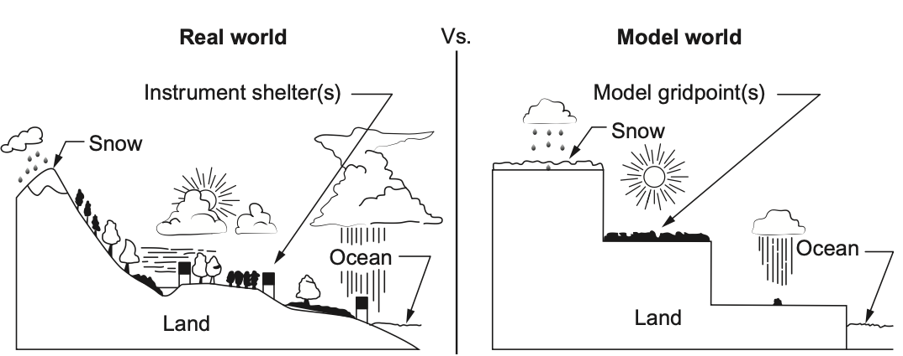
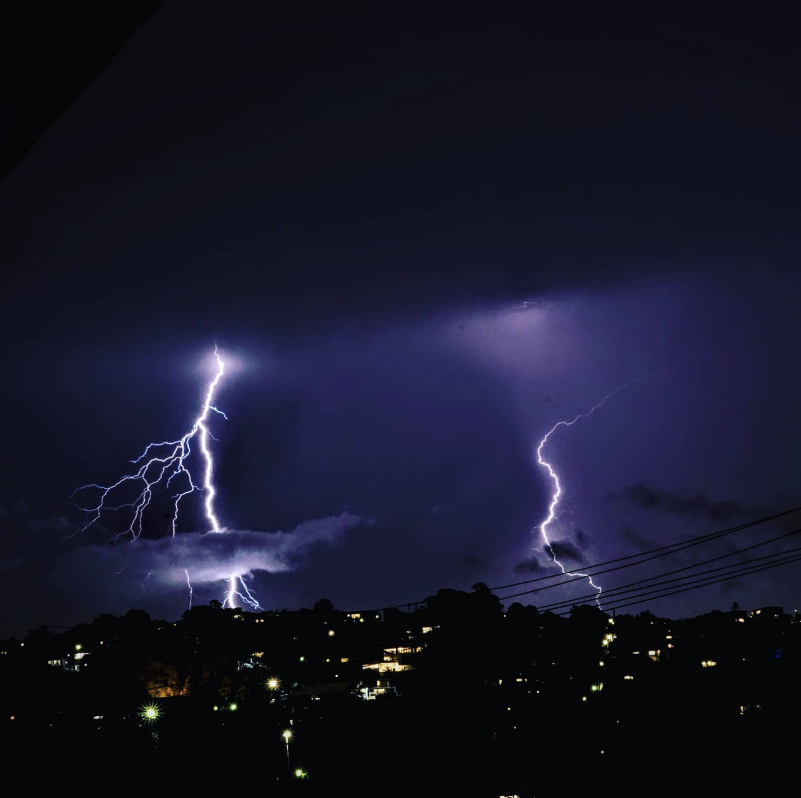

```{r setup, include=FALSE}
knitr::opts_chunk$set(echo = FALSE)
library(tidyverse)
library(shiny)
qut_blue = "#00407a"
qut_dark_blue = "#06ABE8"
```

<!-- Remove slide numbers -->
<style type="text/css">
slides > slide:not(.nobackground):after {
  content: '';
}
</style>

<!-- Make images full size -->
<style>
.fullslide img {
  margin-top: -85px;
  margin-left: -60px;
  width: 900px; 
  height: 700px;
}
</style>

<!-- # Big picture (top and tail) -->

<!-- EMAIL MONASH AND ASK FOR LENGTH -->
<!-- Pitch your cutting edge-ness  -->
<!-- Give myself lots of room at front and the end before getting into technical stuff -->
<!-- Past and future contributions for the field  -->
<!-- At the end where we go from here -->
<!-- (Why is it my research is going to change the world) -->
<!-- How does that fit into the university -->
<!-- Follow up on Centre for the environment -->
<!-- Read the university strategic plans etc. -->

## {.fullslide}

<center>

</center>

<div style="position: absolute; left: 300px; top:450px;background-color:#00407a72";>
<p><font color="white">
<br><strong>Brisbane, January 2011</strong><br>
</font></p></div>


## {.fullslide}

<center>

</center>

<div style="position: absolute; left: 300px; top:150px;background-color:#00407a72";>
<p><font color="white">
<br><strong>Brisbane, February 2021 ? </strong><br>
</font></p></div>

## {.fullslide}

<center>

</center>

<div style="position: absolute; left: 100px; top:150px;background-color:#00407a72";>
<p><font color="white">
<br><strong>How can we use statistics to understand extreme events?</strong><br>
</font></p></div>

## {.fullslide}

<center>

</center>

<div style="position: absolute; left: 150px; top:150px;background-color:#00407a72";>
<p><font color="white">
<strong>Research topics:</strong>
<ul>
<li> - Applications of extreme value theory in climate </li>
<li> - Statistical post-processing of weather forecasts </li>
<li> - Compound climate / weather events </li>
<li> - Quality control of meteorological data </li>
<li> - Impacts of extreme weather in ecology </li>
</ul></font></p></div>

# Weather Forecasts

## Compound Events 

<center>

</center>

<font size = "4">
**Driving Mechanisms**

1) Joint occurrence 

2) Destructive storm surge & rainfall of any kind 

3) Moderate storm surge & heavy/extreme rainfall

</font>

<font size = "2">
More details: Bevacqua, E, $\dots$ Saunders, K. $\dots$ et al. "Guidelines for studying diverse types of compound weather and climate events." Earth's Future 9.11 (2021): e2021EF002340.
</font>

## Mechanism number 3

<center>

</center>


## Ensemble forecasts

<div style="float: left; width: 80%;">
<center>

</center>
</div>

<div style="float: left; width: 20%;">
<font size = "4">
Higher uncertainty in the forecast at 
longer lead times
<br>
<br>
<br>
<br>
<br>
Treat astronomical tide as deterministic
</font>
</div>

## Numerical Weather Models

<center>
<br>
</center>

<font size="2"> 
Karl, T. R., Schlesinger, M. E., & Wang, W. C. (1989). A method of relating general circulation model simulated climate to the observed local climate. I. Central tendencies and dispersion. In: Preprints, sixth conference on Applied Climatology, American Meteorological Society (pp. 188–196).
</font>

## Numerical Weather Models ctd.

<!-- Prediction of the sufficiently distant future is impossible by any method, unless the present conditions are known exactly -->

<center>
<br>
</center>

<font size="2">
From Palmer, T. N. (1993). Extended-range atmospheric prediction and the Lorenz model. Bulletin of the American Meteorological Society, 74, 49–65.
</font>

<!-- ## Challenges -->

<!-- <br><br> -->
<!-- **We can never observe the whole atmosphere.** -->
<!--  - Forecast skill will decay at longer lead times  -->

<!-- <br><br>  -->
<!-- **Mathematical equations approximate the real-world** -->
<!-- - Forecasts need to be validated / adjusted relative to observations  -->

<!-- A single model run tell us nothing about the uncertainty associated with the atmosphere at that time. We can’t know whether the atmosphere is in a predictable state or an unpredictable state, so we can’t know how confident we should be in that particular forecast. -->
<!-- A reliable ensemble of forecasts gives us information on the forecast uncertainty -->

# Statistical Post-processing

## Univariate post-processing 

* Using historical ensemble forecasts and observation pairs we estimate a post-processed forecast density

* Then when a new forecast is issued, we sample from the post-processed forecast density to produce new ensemble members

<center>

</center>

(One Variable, one lead time, one location)
  
<!-- ie. Parametric form ie. normal, so estimate parameters as a function of covariates,   -->
<!--  Non-parametric, ie. random forest.  -->

## Unvariate scores

<font size = "4">
Continuous Rank Probability Score (CRPS) for a forecast CDF, <font color = "#00407a">$F$</font> and scalar observation <font color = "#00407a">$y$</font> is
<font color = "#00407a">
$$\text{crps}(F, y) = \int_\mathbb{R} \left[ F(x) - \mathbb{1}(x \geq y)\right]^2 \text{dx} $$ 
</font>
</font>

```{r echo = FALSE, eval = TRUE, out.width="70%", fig.align='center'}
xmin = -4
xmax = 4 
obs = 1
xseq = seq(obs, xmax, length.out = 100)
crps_score <- ggplot(data = NULL) +
      stat_function(fun = pnorm, xlim = c(xmin, xmax)) +
      stat_function(fun = pnorm, xlim = c(xmin, obs), geom = "area",
                fill = "blue", alpha = 0.3) +
      geom_ribbon(aes(x = xseq, ymin = pnorm(xseq), ymax = rep(1, length(xseq))),
              fill = "blue", alpha = 0.3) +
      geom_vline(xintercept = obs, linetype = "dashed") +
      xlab("x") +
      ylab("Cumulative Distribution Function") +
      ggtitle("Continuous Rank Probability Score") +
      theme_bw()
crps_score
```


<!-- --- -->

<!-- <font size="3"> -->
<!-- $$\text{crps}(F, y) = \int_\mathbb{R} \left[ F(x) - \mathbb{1}(x \geq y)\right]^2 \text{dx} $$  -->
<!-- </font> -->

<!-- ```{r eval = FALSE, echo = FALSE, out.width="20%", fig.align='center'} -->

<!-- xmin = -4 -->
<!-- xmax = 4 -->

<!-- # Define UI ---- -->
<!-- ui <- fluidPage( -->
<!--   plotOutput("plot1"), -->
<!--   sliderInput("obs", "Observation", min = xmin, max = xmax, value = 1) -->
<!-- ) -->

<!-- # Define server logic ---- -->
<!-- server <- function(input, output) { -->
<!--   output$plot1 <- renderPlot({ -->

<!--     # obs = 1 -->
<!--     xseq = seq(input$obs, xmax, length.out = 100) -->
<!--     crps_score <- ggplot(data = NULL) + -->
<!--       stat_function(fun = pnorm, xlim = c(xmin, xmax)) + -->
<!--       stat_function(fun = pnorm, xlim = c(xmin, input$obs), geom = "area", -->
<!--                 fill = "blue", alpha = 0.3) + -->
<!--       geom_ribbon(aes(x = xseq, ymin = pnorm(xseq), ymax = rep(1, length(xseq))), -->
<!--               fill = "blue", alpha = 0.3) + -->
<!--       geom_vline(xintercept = input$obs, linetype = "dashed") + -->
<!--       xlab("x") + -->
<!--       ylab("Cumulative Distribution Function") + -->
<!--       ggtitle("Continuous Rank Probability Score") + -->
<!--       theme_bw() -->
<!--   crps_score -->
<!--   }) -->

<!-- } -->

<!-- # Run the app ---- -->
<!-- shinyApp(ui = ui, server = server) -->
<!-- ``` -->

<!-- ## Proper scores -->

<!-- * Let a score for a predictive distribution $P$ and observation $y$, $S(P, y)$. -->

<!-- * $S(P, y)$ is positively orientated, larger is better -->

<!-- * If the best possible forecast distribution is $Q$, a $S(.,.)$ is strictly proper if for all $Q$ and $P$ -->

<!-- $$S(Q, Q) \geq S(P,Q).$$ -->


<!-- Others see textbook -->

## Restore dependence 

<div style="float: left; width: 65%;">
<center>

</center>
</div>

<div style="float: left; width: 35%;">
- One variable <br> 
- Multiple lead times <br> 
- One location <br>
</div>

<!-- ## Restore dependence  -->

<!-- <div style="float: left; width: 65%;"> -->
<!-- <center> -->
<!--  -->
<!-- </center> -->
<!-- </div> -->

<!-- <div style="float: left; width: 35%;"> -->
<!-- - Fixed variable <br>  -->
<!-- - Multiple lead times <br>  -->
<!-- - Fixed location <br> -->

<!-- <br><br><br> -->
<!-- <strong> Under the hood: </strong> <br> -->

<!-- - Skylar's Theorem <br> -->
<!-- - Empircal copula -->
<!-- </div> -->

<!-- (Fixed variable, Multiple lead time, single location) -->
<!-- Needs to consider multiple lead times  -->
<!-- Behaviour of the trajectory is important -->

## R Package

<!-- * Flow-dependent versus climate -->

<!-- * Minimum divergence methods for picking historical dates (slow) -->


R Package <font color = "#00407a">**depPPR**</font> (
<font color = "#00407a">**dep**</font>endence 
<font color = "#00407a">**P**</font>ost</font>-<font color = "#00407a">**P**</font>rocessing in 
<font color = "#00407a">**R**</font>)

```{r eval = FALSE, echo = TRUE}
library(devtools)
devtools::install_github("katerobsau/depPPR")
library(depPPR)
```

**Contains methods for:**

* Different methods for sampling ensemble members 
* Empirical copula coupling 
* Schaake shuffle (including date stratefication)
* Minimum divergence Schaake shuffle 
* Backward selection methods for date selection

<!-- * software as a research output -->

<!-- ## Package -->

<!-- depPPR -->

<!-- * reproducible research  -->
<!-- * open source software  -->
<!-- * software as a research output -->

## Energy Score

<font color = "#00407a">
$$ES(F, \mathbf{y}) = \dfrac{1}{m} \sum_{k=1}^m \| \mathbf{x}^{(k)} - \mathbf{y}\| - 
  \dfrac{1}{2m^2}\sum_{k=1}^m \sum_{l=1}^m \| \mathbf{x}^{(k)} - \mathbf{x}^{(l)}\|$$
</font>

where 

* <font color = "#00407a">$F$</font> is the forecast distribution 
* <font color = "#00407a">$\mathbf{y}$</font> is a vector of <font color = "#00407a">$d$</font> observations 
* <font color = "#00407a">$m$</font> is the number of ensemble members 
* <font color = "#00407a">$\mathbf{x}^{(k)}$</font> is a vector corresponding to the <font color = "#00407a">$k^{th}$</font> ensemble member
* <font color = "#00407a">$\| \cdot \|$</font> is the Euclidean norm on <font color = "#00407a">$\mathbb{R}^2$</font>.

## Energy Score 

<div style="float: left; width: 65%;">

</div>

<div style="float: left; width: 35%;">

</div>  

<div style="float: left; width: 100%;">

* Lower scores are better 
* **GOOD** - <font color = "#C9B63F"> Raw forecast</font> clearly different 
* **BAD** - <font color = "#609CFF"> Post-processed forecast with no meaningful dependence </font> isn't clearly different

</div>

## Variogram Score

<font color = "#00407a">
$$VS_{0.5} (F, y) = \sum^d_{i=1}\sum^d_{j=1} w_{ij} \left( \left| y_i - y_j \right|^{0.5} - \dfrac{1}{m} \sum_{k=1}^m  \left| x_i^{(k)} - x_j^{(k)} \right|^{0.5} \right) $$
</font>
where 

* <font color = "#00407a">$F$</font> is the forecast distribution 
* <font color = "#00407a">$\mathbf{y}$</font> is a vector of <font color = "#00407a">$d$</font> observations 
* <font color = "#00407a">$m$</font> is the number of ensemble members 
* <font color = "#00407a">$\mathbf{x}^{(k)}$</font> is a vector corresponding to the <font color = "#00407a">$k^{th}$</font> ensemble member
* <font color = "#00407a">$w_{i,j}$</font> is a weight (default is 1)

## Variogram Score 

<div style="float: left; width: 65%;">

</div>

<div style="float: left; width: 35%;">

</div>  

<div style="float: left; width: 100%;">

* Lower scores are better 
* **GOOD** - <font color = "#609CFF"> Post-processed forecast with no meaningful dependence </font> clearly different
* **BAD** - <font color = "#C9B63F"> Raw forecast</font> isn't clearly different 

</div>

<!-- ## Inverse Distance Weights  -->

<!-- <center> -->
<!--  -->
<!-- </center> -->
 
## Weighted Variogram Score 

<div style="float: left; width: 50%;">

</div>

<div style="float: left; width: 50%;">

</div>  

<div style="float: left; width: 100%;">

* **BETTER** - Seeing differentiation between <font color = "#C9B63F"> raw forecast </font> and those with post-processed univariate marginals 

</div> 
 
## Temporally decaying weights

<div style="float: left; width: 50%;">

</div>

<div style="float: left; width: 50%;">

</div>  

<div style="float: left; width: 100%;">

* **BEST** - Seeing differentiation between <font color = "#C9B63F"> raw forecast </font> and those with post-processed univariate marginals 
* <font color = "F9766D"> Post-processed forecast with a dependence template from the ensemble </font> edges out those using historical dates

</div> 

## Storm Surge Example

<div style="float: left; width: 70%;">

</div>

<div style="float: left; width: 30%;">

</div>

## Key Points 

* Weather forecasts aren't perfect 

* Forecasts need statistical post-processing

* Watch out for weights in scoring

* For compound events the driving mechanisms matter 

<!-- when scoring forecasts of temporal trajectories    -->
<!-- (Inter-variable scoring is tricky for similar reasons) -->

<!-- * Important to understand driving mechanism for post-processing & scoring forecasts related to compound events -->

<!-- * Choosing the dependence template also needs to be done carefully for compound events   -->

(Saunders et al. in preparation for Monthly Weather Review  
expected submission mid 2022)

<!-- Under what weather forecast are - uncertainty  -->
<!-- General idea behind statistical post-processing -->
<!-- Some of the nuance behind scoring -->

## {.fullslide}

<center>

</center>

<div style="position: absolute; left: 100px; top:150px;background-color:#00407a72";>
<p><font color="white">
<strong>What else can we do to improve our weather forecasts - <br>
particularly of extremes?
</strong>
</font></p></div>


# Crowd-sourced Data

<!-- Approximately 15 minutes -->

## Missing Events 

<div style="float: left; width: 90%;">

</div>

<div style="float: left; width: 10%;">
<font size = "4">
Official 
<br><br><br><br><br><br><br><br>
Crowd-sourced
</font>
</div>

## So much potential

<font color="#00407a">
**Crowd-sourced observations are an untapped data resource**
</font>

## So much potential

<font color="#00407a">
**Crowd-sourced observations are an untapped data resource**
</font>  

<br>
<font color="#00407a">
**Garbage In = Garbage Out**
</font>  

## So much potential

<font color="#00407a">
**Crowd-sourced observations are an untapped data resource**
</font>  

<br> 
<font color="#00407a">
**Garbage In = Garbage Out**
</font>  

<center>

</center>

<!-- Well known the quality is terrible  -->
<!-- Signal in the noise  -->

## Quality Control

<font color="#00407a">
**Data needs quality assurance**
</font>

## Quality Control

<font color="#00407a">
**Data needs quality assurance**
</font>

<br>
<font color="#00407a">
**Approach must be tailored for crowd-sourced observations**
</font>

## Quality Control

<font color="#00407a">
**Data needs quality assurance**
</font>

<br>
<font color="#00407a">
**Approach must be tailored for crowd-sourced observations**
</font>

<div style="float: left; width: 70%;">

</div>
<div style="float: left; width: 30%;">
<font size = "4">
<font color="orange">
WOW: Crowd-sourced
</font>
<br>
KNMI: Official Stations <br>

</font>
</center>

## Crowd-sourced QC Problems 

<font color="#00407a">
**Often don't know if it's instrumentation error**
</font>

  * don't know sensor sensitivity
  * don't know sensor type

## Crowd-sourced QC Problems 

Often don't know if it's instrumentation error  

  * don't know sensor sensitivity
  * don't know sensor type

<font color="#00407a">
**Don't know if it's a positioning error**   
</font>  

  * height of the sensor 
  * positioning urban versus an open field
  * blockage eg. positioned beside a building

## Crowd-sourced QC Problems 

Often don't know if it's instrumentation error  

  * don't know sensor sensitivity
  * don't know sensor type
  
Don't know if it's a positioning error   

  * height of the sensor 
  * positioning urban versus an open field
  * blockage eg. positioned beside a building
  
<font color="#00407a">
**Can't compare data spatially**
</font>

<!-- issue becasue forecasts at issued at a 10 m height -->
<!-- data is not appropriate for assimilation or for post-processing -->

## {.fullslide}


<div style="position: absolute; left: 100px; top:150px;background-color:#00407a72";>
<p><font color="white">
<strong>The raw crowd-sourced data is trash, so .. <br>  
<br>  
Why can't we just install more official stations? </strong><br>   
</font></p></div>

## {.fullslide}


<div style="position: absolute; left: 100px; top:150px;background-color:#00407a72";>
<p><font color="white">
<strong>The raw crowd-sourced data is trash, so .. <br>  
<br>  
Is there value in crowd-sourced observations of wind?</strong><br>  

</font></p></div>


## Quality Control Pipeline

<center>
<br>


## Empirical Quantile Mapping  

* Let the empirical cumulative distribution function (CDF) of the WOW observations be <font color="#00407a">$\hat{F}_X(x)$</font>  
* Let the CDF of the true 10 m observations be <font color="#00407a">$F_Y(y)$</font>  

A WOW observation <font color="#00407a">$x_t$</font> at time <font color="#00407a">$t$</font> is then bias-corrected using the mapping 

<center><font color="#00407a">
$$ \tilde{x}_t = F_Y^{-1}\big( \hat{F}_X(x_t) \big). $$
</font>

## Need to be careful

* Censored low wind speeds are recorded as repeated zeros
* Repeated zeros fail the persistence test under standard QC
* <font color="#00407a">**Must not discard this probability mass!!**</font>

<center>

 
## An advantage of EQM

* Easily account for the probability mass at zero
* Easily bias-adjust non-zero WOW wind speeds  
* Can interpolate censored low wind speeds separately

<center>


## Challenge

<font color="#00407a">
**We don't have an official reference station for every WOW station** 
</font>

## Challenge

We don't have an official reference station for every WOW station 

so ...

<center><font color="#00407a">
**We can't easily adjust the bias in crowd-sourced observations** 
</font>

## Challenge

We don't have an official reference station for every WOW station 

so ...

We can't easily adjust the bias in crowd-sourced observations 

but ...   

<font color="#00407a">
**We can estimate the reference truth for $F_Y(y)$**   
</font>

## Spatial Interpolation

<div style="float: left; width: 65%;">
<center>

</center>
</div>

<div style="float: left; width: 35%;">
50th Percentile for Winter
</div>

## Kriging

* Use ordinary kriging for <font color="#00407a">**spatial interpolation**</font>
* Interpolate <font color="#00407a">**100 quantiles**</font> using KNMI station quantiles
* Estimate an <font color="#00407a">**empirical CDF**</font> using the estimated quantiles 
* That distribution is used as the <font color="#00407a">**reference distribution**</font> for our WOW data

<center>


## Quality Control Flowchart

<br>
<center>


## Results 

<div style="float: left; width: 70%;">

</div>

<div style="float: left; width: 30%;">
<font color="red">Raw WOW</font><br>

Official Stations<br>

<font color="blue">Quality Controlled and Bias Adjusted WOW</font>
</div>

## Results 

<div style="float: left; width: 70%;">

</div>

<div style="float: left; width: 30%;">
<font color="red">Raw WOW</font><br>

<font color="blue">Quality Controlled and Bias Adjusted WOW</font>
</div>

## Wind Direction 

Vacation students: Peter Tarbit and Yousof Nowrozi
<center>


## Wind Direction 

<center>


## Wind Gusts

<center>
<blockquote class="twitter-tweet"><p lang="en" dir="ltr">In exciting news, my colleague <a href="https://twitter.com/kiriwhan?ref_src=twsrc%5Etfw">@kiriwhan</a> and I were awarded the Harry Otten prize in meteorology 🎉🤯Our project: Second Wind is about using crowd-sourced wind gusts to complement official records. (Here is us circa 2019 at the climate march in Den Haag pre pandemic) <a href="https://t.co/Oz7Rq2AU6C">pic.twitter.com/Oz7Rq2AU6C</a></p>&mdash; Kate Saunders (@KateRobSau) <a href="https://twitter.com/KateRobSau/status/1435757504521064448?ref_src=twsrc%5Etfw">September 9, 2021</a></blockquote> <script async src="https://platform.twitter.com/widgets.js" charset="utf-8"></script>

## {.fullslide}


<div style="position: absolute; left: 100px; top:150px;background-color:#00407a72";>
<p><font color="white">
<strong> With quality crowd-sourced wind observations:</strong>
<!-- <li> -->
<ul> Can improve our climatological understanding of <br> 
wind extremes </ul>
<ul>Can implement statistical and machine learning methods <br>
that are data hungry </ul>
<ul>Operationally: <br>
Data assimilation, improved forecasts and warnings </ul>
<ul>Industry: <br>
Insurance sector and energy sector </ul>
<!-- </li> -->
</font></p>
</div>

<!-- ## {.fullslide} -->

<!--  -->

<!-- <div style="position: absolute; left: 100px; top:150px;background-color:#00407a72";> -->
<!-- <p><font color="white"> -->
<!-- But what about Australia? -->
<!-- </font></p></div> -->

<!-- - our station network of citizen science stations is much sparser compared ot the NL -->
<!-- we aren't flat -->

# Future directions

## Climate ethics 

```{r echo = FALSE, warning=FALSE, message=FALSE}
library(rnoaa)
library(tidyverse)
library(leaflet)
library(rnaturalearth)

australia_sf <- rnaturalearth::ne_countries(country = 'australia',
                                              returnclass = 'sf')

res <- rnoaa::isd_stations() %>%
  filter(ctry == 'AS') %>%
  mutate(ll = s2::s2_lnglat(lon, lat)) %>%
  filter(s2::s2_within(ll, australia_sf)) %>% 
  filter(end > 20200000)

leaflet(data = res) %>%
  addTiles() %>%
  addCircles(radius = 10000) %>%
  addCircles(radius = 10) 
```


## {.fullslide}


<div style="position: absolute; left: 75px; top:150px;background-color:#00407a72";>
<p><font color="white">
<ul>

<li> Where are our blind-spots for wind data? </li> 

<li> Do those blind-spots overlap with regions of bushfire risk? </li>

<li> Do those blind-spots overlap with regions of cyclone risk? </li>

<li> Can high quality crowd-sourced data improve forecast skill? </li>

<li> Which observations generate the most value? </li>

</ul>
</font></p></div>

<!-- * student projects galore in QC citizen science data  -->

<!-- * examining Where will additional observations give us the greatest increase in our forecast -->

## Bushfire modelling

<center>

</center>
ACEMS Ideas Challenge: Dr. Carolyn Huston (CSIRO), Sherry Zhang (Monash), Dr. Petra Kuhnert (CSIRO)

## Climate emergency


<!-- * Australian megafires were more likely due to climate change  -->

<!-- * Recurrence period between large fires is decreasing  -->


## Responsible Innovation

<!-- * ACEMS Ideas Challenge / QUT CDS  -->

<div style="float: left; width: 70%;">

</div>

<div style="float: left; width: 30%;">
<p><font color="#00407a"><strong> Let's build the future we want!</strong></font></p>


</div>

<!-- <div style="position: absolute; left: 450px; top:150px;background-color:#00407a72";> -->
<!-- <p><font color="white"> -->
<!-- <strong> Let's build the future we want! </strong> -->
<!-- </font></p></div> -->

<!-- <div style="float: left; width: 50%;"> -->
<!-- <br> -->
<!-- <br> -->

<!-- <br> -->
<!-- <br> -->

<!-- </div> -->

<!-- ## ACEMS Ideas Challenge / CSIRO Data 61 -->

<!-- * working on identifying bushfire blindspots  -->

<!-- * student projects galore in QC citizen science data  -->

<!-- * examining where additional observations will give us the greatest increase in our forecast -->

## Conclusions 

* Explained the importance of statistical post-processing 

* Explored the potential and pitfalls of crowd-sourced wind observations

* Shown we can innovate to create the data future we need

**e.** kate.r.saunders@qut.edu.au

**t.** @katerobsau

**g.** github.com/katerobsau

## {.fullslide}

<center>
<blockquote class="twitter-tweet"><p lang="en" dir="ltr">Just a guy taking his dog for a walk. Dog seems into it 🤷‍♀️ <a href="https://twitter.com/hashtag/queenslandfloods?src=hash&amp;ref_src=twsrc%5Etfw">#queenslandfloods</a> <a href="https://twitter.com/hashtag/extremerainfall?src=hash&amp;ref_src=twsrc%5Etfw">#extremerainfall</a> <a href="https://t.co/0xTqGvlXSo">pic.twitter.com/0xTqGvlXSo</a></p>&mdash; Kate Saunders (@KateRobSau) <a href="https://twitter.com/KateRobSau/status/1497118343148363778?ref_src=twsrc%5Etfw">February 25, 2022</a></blockquote> <script async src="https://platform.twitter.com/widgets.js" charset="utf-8"></script>

## {.fullslide}



<div style="position: absolute; left: 300px; top:150px;background-color:#00407a72";>
<p><font color="white"; size = "8">
<strong> Questions? </strong>
</font></p></div>


## Finer Details for Kriging and EQM

* Wind has a <font color="#00407a">**diurnal cycle**</font> (split into two periods)
* Wind has a <font color="#00407a">**seasonal cycle**</font> (split into three seasons)
* So we need perfrom Kriging and EQM for six different periods
* Five fold cross validation (robustness)

<center>


## Standard Spatial QC

<font color="#00407a">**General:** </font>

* Have some target observation
* Identify neighbour stations using some similarity metric (ie. Pearson)
* Estimate value at your target location using the neighbours (ie. IDW)
* Estimate confidence interval at your target location using the neighbours
* Reject/flag the target observation if it falls outside the confidence interval

## Adjustments to Spatial QC

<font color="#00407a">**Key Differences:**</font> 

* Used a similarly metric of the Earth Mover's Distance in addition to Pearson
* Earth Mover's Distance is a distance metric  
  (shown shaded in grey)

<center>


## Adjustments to Spatial QC

<font color="#00407a">**Key Differences:**</font> 

* Used a similarly metric of the Earth Mover's Distance in addition to Pearson
* Earth Mover's Distance is a similarity metric
* Use a truncated normal for to estimate the confidence interval 

## Full circle

<font color="#00407a">**What's really handy is methods for spatial quality control estimate a value at a target location**</font>

## Full circle

What's really handy is methods for spatial quality control estimate a value at a target location

<br><br><font color="#00407a">
**That's exactly what we need to interpolate the low wind speeds that were censored**
</font>

## Full circle

What's really handy is methods for spatial quality control estimate a value at a target location

<br><br>
That's exactly what we need to interpolate the low wind speeds that were censored

<br><br><font color="#00407a">
**So that's what we do!**
</font>

<script src = "assets/beamer.js"></script>

<!-- Talk about cost of these statiosn vs official network -->
<!-- Add in distances  -->
<!-- Emphasise high value observations -->
